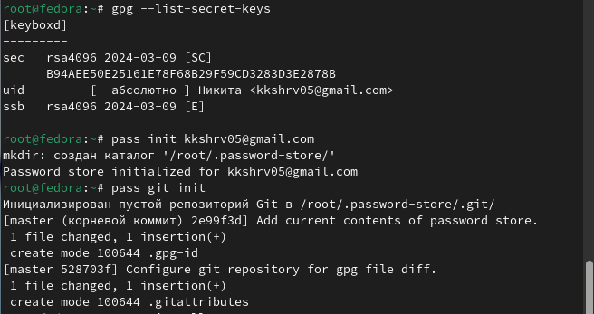
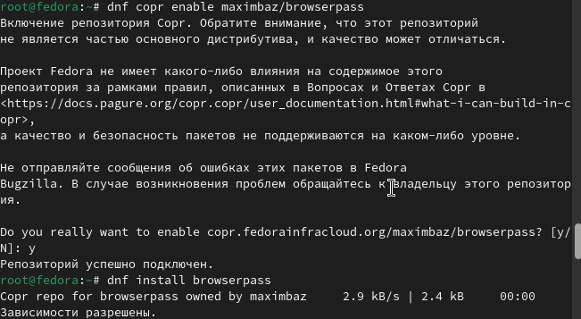
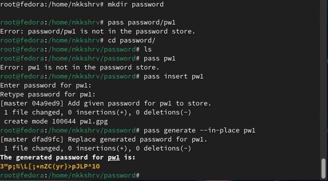
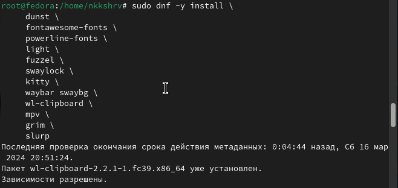
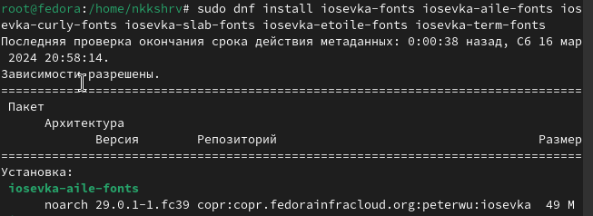
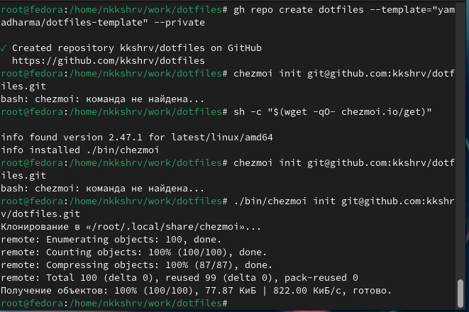
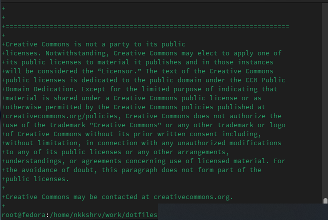
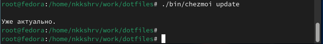
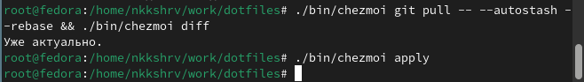
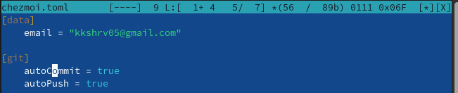

---
## Front matter
title: "Отчет по лабораторной работе №5"
subtitle: "Операционные системы"
author: "Никита Сергеевич Кокшаров"

## Generic otions
lang: ru-RU
toc-title: "Содержание"

## Bibliography
bibliography: bib/cite.bib
csl: pandoc/csl/gost-r-7-0-5-2008-numeric.csl

## Pdf output format
toc: true # Table of contents
toc-depth: 2
lof: false # List of figures
lot: true # List of tables
fontsize: 12pt
linestretch: 1.5
papersize: a4
documentclass: scrreprt
## I18n polyglossia
polyglossia-lang:
  name: russian
  options:
	- spelling=modern
	- babelshorthands=true
polyglossia-otherlangs:
  name: english
## I18n babel
babel-lang: russian
babel-otherlangs: english
## Fonts
mainfont: PT Serif
romanfont: PT Serif
sansfont: PT Sans
monofont: PT Mono
mainfontoptions: Ligatures=TeX
romanfontoptions: Ligatures=TeX
sansfontoptions: Ligatures=TeX,Scale=MatchLowercase
monofontoptions: Scale=MatchLowercase,Scale=0.9
## Biblatex
biblatex: true
biblio-style: "gost-numeric"
biblatexoptions:
  - parentracker=true
  - backend=biber
  - hyperref=auto
  - language=auto
  - autolang=other*
  - citestyle=gost-numeric
## Pandoc-crossref LaTeX customization
figureTitle: "Рис."
tableTitle: "Таблица"
listingTitle: "Листинг"
lofTitle: "Список иллюстраций"
lotTitle: "Список таблиц"
lolTitle: "Листинги"
## Misc options
indent: true
header-includes:
  - \usepackage{indentfirst}
  - \usepackage{float} # keep figures where there are in the text
  - \floatplacement{figure}{H} # keep figures where there are in the text
---

# Цель работы

Цель работы --- обучиться работе с менеджером паролей pass и управлению файлами
конфигурации.

# Выполнение лабораторной работы

После установки `pass`, `pass-otp`, `gopass` инициализирую хранилище с
помощью `pass` и синхронизирую его с git (рис. [-@fig:001]).

{#fig:001 width=70%}

Устанавливаю плагин к браузеру и интерфейс `browserpass` (рис. [-@fig:002]).

{#fig:002 width=70%}

С помощью команды `pass` создаю пароль (рис. [-@fig:003])

{#fig:003 width=70%}

Устанавливаю некоторое дополнительное программное обеспечение (рис. [-@fig:004]).

{#fig:004 width=70%}

Устанавливаю необходимые шрифты (рис. [-@fig:005]).

{#fig:005 width=70%}

Создаю новый репозиторий для файлов-конфигов и инициализирую `chezmoi` с
созданным репозиторием (рис. [-@fig:006]).

{#fig:006 width=70%}

Соглашаюсь со внесененными изименениями (рис. [-@fig:007]).

{#fig:007 width=70%}

Извлекаю последние изменения из репозитория и применяю их (рис. [-@fig:008]).

{#fig:008 width=70%}

Извлекаю последние изменения из репозитория и применяю их вручную (рис. [-@fig:009]).

{#fig:009 width=70%}

Включаю функцию автоматического отправления изменений (рис. [-@fig:010]).

{#fig:010 width=70%}

# Выводы

В ходе работы я обучился работе с менеджером паролей `pass`, а также управлению файлами
конфигурации.

# Список литературы{.unnumbered}

::: {#refs}
:::
