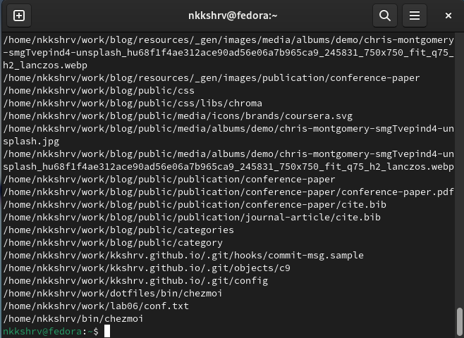

---
## Front matter
title: "Отчет по лабораторной работе №8"
subtitle: "Операционные системы"
author: "Никита Сергеевич Кокшаров"

## Generic otions
lang: ru-RU
toc-title: "Содержание"

## Bibliography
bibliography: bib/cite.bib
csl: pandoc/csl/gost-r-7-0-5-2008-numeric.csl

## Pdf output format
toc: true # Table of contents
toc-depth: 2
lof: true # List of figures
lot: false # List of tables
fontsize: 12pt
linestretch: 1.5
papersize: a4
documentclass: scrreprt
## I18n polyglossia
polyglossia-lang:
  name: russian
  options:
	- spelling=modern
	- babelshorthands=true
polyglossia-otherlangs:
  name: english
## I18n babel
babel-lang: russian
babel-otherlangs: english
## Fonts
mainfont: PT Serif
romanfont: PT Serif
sansfont: PT Sans
monofont: PT Mono
mainfontoptions: Ligatures=TeX
romanfontoptions: Ligatures=TeX
sansfontoptions: Ligatures=TeX,Scale=MatchLowercase
monofontoptions: Scale=MatchLowercase,Scale=0.9
## Biblatex
biblatex: true
biblio-style: "gost-numeric"
biblatexoptions:
  - parentracker=true
  - backend=biber
  - hyperref=auto
  - language=auto
  - autolang=other*
  - citestyle=gost-numeric
## Pandoc-crossref LaTeX customization
figureTitle: "Рис."
tableTitle: "Таблица"
listingTitle: "Листинг"
lofTitle: "Список иллюстраций"
lotTitle: "Список таблиц"
lolTitle: "Листинги"
## Misc options
indent: true
header-includes:
  - \usepackage{indentfirst}
  - \usepackage{float} # keep figures where there are in the text
  - \floatplacement{figure}{H} # keep figures where there are in the text
---

# Цель работы

Ознакомление с инструментами поиска файлов и фильтрации текстовых данных.
Приобретение практических навыков: по управлению процессами (и заданиями), по
проверке использования диска и обслуживанию файловых систем.

# Выполнение лабораторной работы

Записываю названия файлов из каталога /etc в файл file.txt, а также добавляю туда названия файлов из домашнего каталога (рис. [-@fig:001]).

{#fig:001 width=70%}

Проверяю корректность работы команд (рис. [-@fig:002]).

{#fig:002 width=70%}

Вывожу имена всех файлов из file.txt расширения .conf (рис. [-@fig:003])

{#fig:003 width=70%}

Записываю их в conf.txt (рис. [-@fig:004]).

{#fig:004 width=70%}

Проверяю корректность работы команд (рис. [-@fig:005]).

{#fig:005 width=70%}

Вывожу файлы, имена которых начинаются с символа `c` с помощью команды find (рис. [-@fig:006]).

{#fig:006 width=70%}

Делаю то же самое альтернативным способом (рис. [-@fig:007]).

{#fig:007 width=70%}

Вывожу имена файлов из каталога /etс, начинающиеся с h (рис. [-@fig:008]).

{#fig:008 width=70%}

В фоновом режиме запускаю запись имен файлов типа log* в файл ~/logfile (рис. [-@fig:009]).

{#fig:009 width=70%}

Удаляю logfile (рис. [-@fig:010]).

{#fig:010 width=70%}

Запускаю в фоновом режиме gedit (рис. [-@fig:011]).

{#fig:011 width=70%}

С помощью ps aux и grep нахожу идентификатор процесса gedit (рис. [-@fig:012]).

{#fig:012 width=70%}

После прочтения руководства по команде kill завершаю процесс gedit (рис. [-@fig:013]).

{#fig:013 width=70%}

С помощью команды df вывожу все файловые системы, модификатор -T позволяет узнать тип файловых систем (рис. [-@fig:014]).

{#fig:014 width=70%}

С помощью команды du и модификатора узнаю итоговый объем всех файлов на виртуальной машине (рис. [-@fig:015]).

{#fig:015 width=70%}

С помощью команды find и модификатора -type d вывожу все директории в домашнем каталоге (рис. [-@fig:016]).

{#fig:016 width=70%}

# Выводы

По итогам лабораторной работы я ознакомился с инструментами поиска файлов и фильтрации текстовых данных, приобрел следующие практические навыки: по управлению процессами (и заданиями), по проверке использования диска и обслуживанию файловых систем.
