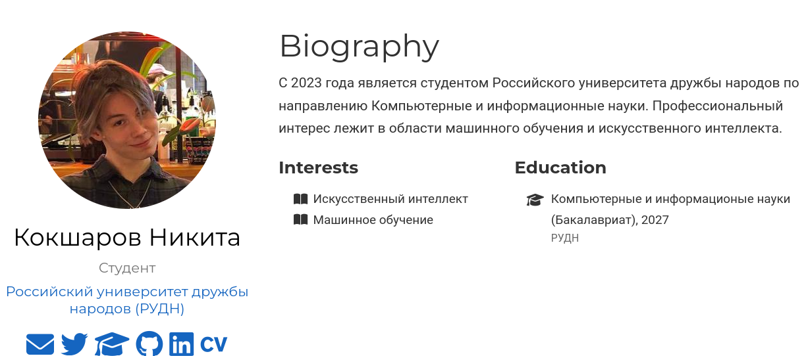

---
## Front matter
title: "Индивидуальный проект. Этап 2"
subtitle: "Операционные системы"
author: "Кокшаров Никита Сергеевич"

## Generic otions
lang: ru-RU
toc-title: "Содержание"

## Bibliography
bibliography: bib/cite.bib
csl: pandoc/csl/gost-r-7-0-5-2008-numeric.csl

## Pdf output format
toc: true # Table of contents
toc-depth: 2
lof: true # List of figures
lot: false # List of tables
fontsize: 12pt
linestretch: 1.5
papersize: a4
documentclass: scrreprt
## I18n polyglossia
polyglossia-lang:
  name: russian
  options:
	- spelling=modern
	- babelshorthands=true
polyglossia-otherlangs:
  name: english
## I18n babel
babel-lang: russian
babel-otherlangs: english
## Fonts
mainfont: PT Serif
romanfont: PT Serif
sansfont: PT Sans
monofont: PT Mono
mainfontoptions: Ligatures=TeX
romanfontoptions: Ligatures=TeX
sansfontoptions: Ligatures=TeX,Scale=MatchLowercase
monofontoptions: Scale=MatchLowercase,Scale=0.9
## Biblatex
biblatex: true
biblio-style: "gost-numeric"
biblatexoptions:
  - parentracker=true
  - backend=biber
  - hyperref=auto
  - language=auto
  - autolang=other*
  - citestyle=gost-numeric
## Pandoc-crossref LaTeX customization
figureTitle: "Рис."
tableTitle: "Таблица"
listingTitle: "Листинг"
lofTitle: "Список иллюстраций"
lotTitle: "Список таблиц"
lolTitle: "Листинги"
## Misc options
indent: true
header-includes:
  - \usepackage{indentfirst}
  - \usepackage{float} # keep figures where there are in the text
  - \floatplacement{figure}{H} # keep figures where there are in the text
---

# Цель работы

Цель работы -- добавить на сайт Hugo часть данных о себе.

# Задание

Список добавляемых данных: разместить фотографию владельца сайта, разместить краткое описание владельца 
сайта (Biography), добавить информацию об интересах (Interests), добавить информацию от образовании 
(Education), сделать пост по прошедшей неделе, добавить пост на тему по выбору.

# Выполнение лабораторной работы

В папке `content` текущего репозитория удаляю демо-аватар и сохраняю собственный (рис. [-@fig:001]).

{#fig:001 width=70%}

Редактирую ФИО и роль в файле `_index.md` (рис. [-@fig:002]).

{#fig:002 width=70%}

Также редактирую биографию (рис. [-@fig:003]).

{#fig:003 width=70%}

Указываю свои интересы (рис. [-@fig:004]).

{#fig:004 width=70%}

Редактирую блок с местом обучения (рис. [-@fig:005]).

{#fig:005 width=70%}

По уже знакомому алгоритму выгружаю данные на гитхаб (рис. [-@fig:006]).

{#fig:006 width=70%}

# Выводы

В ходе проведенной работы получились следующие изменения (рис. [-@fig:007]).

{#fig:007 width=70%}

# Список литературы{.unnumbered}

::: {#refs}
:::
